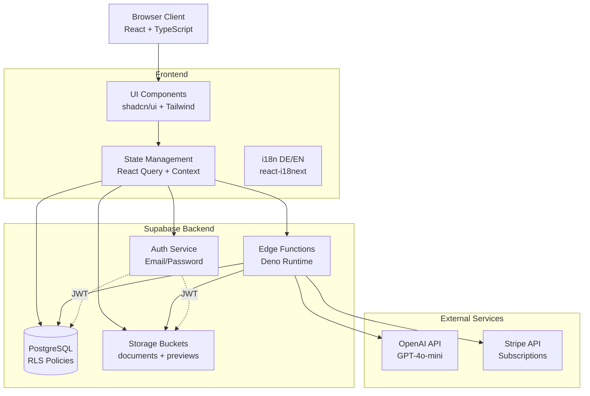
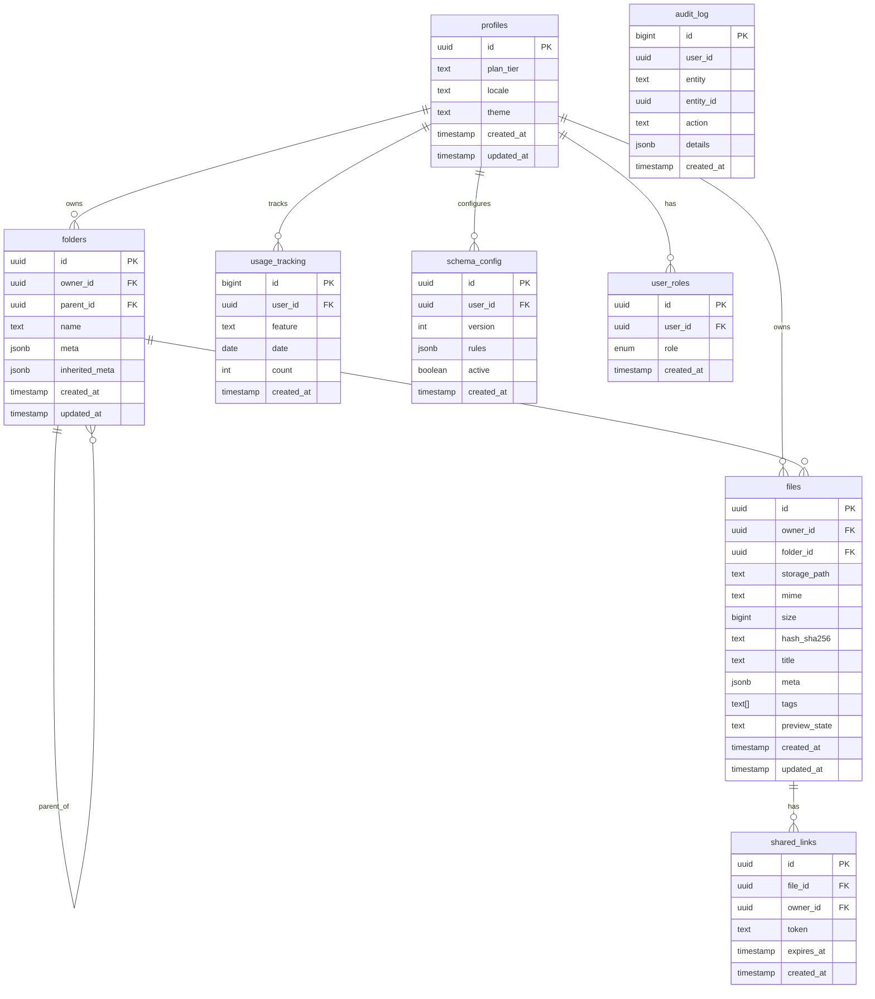
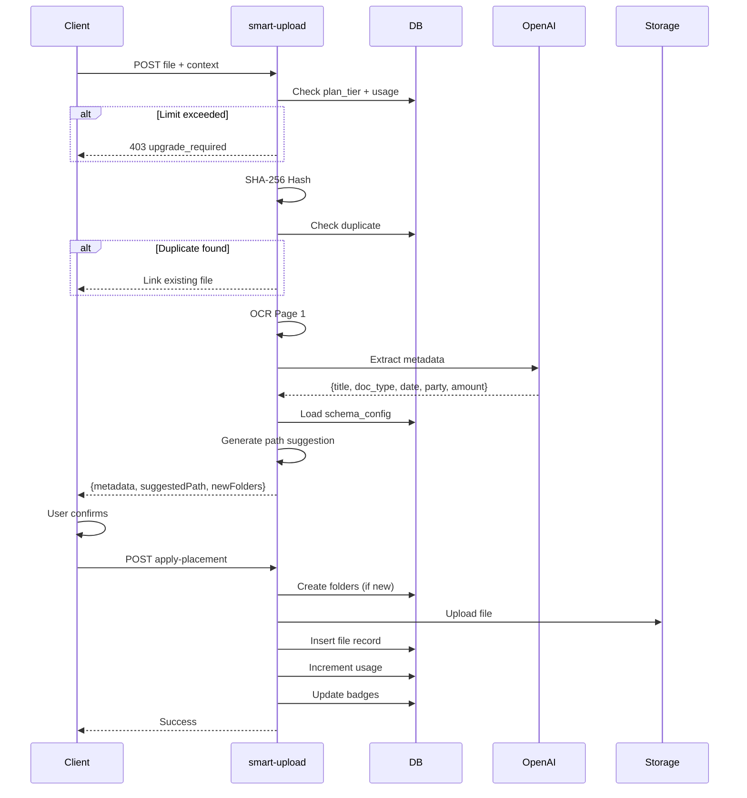
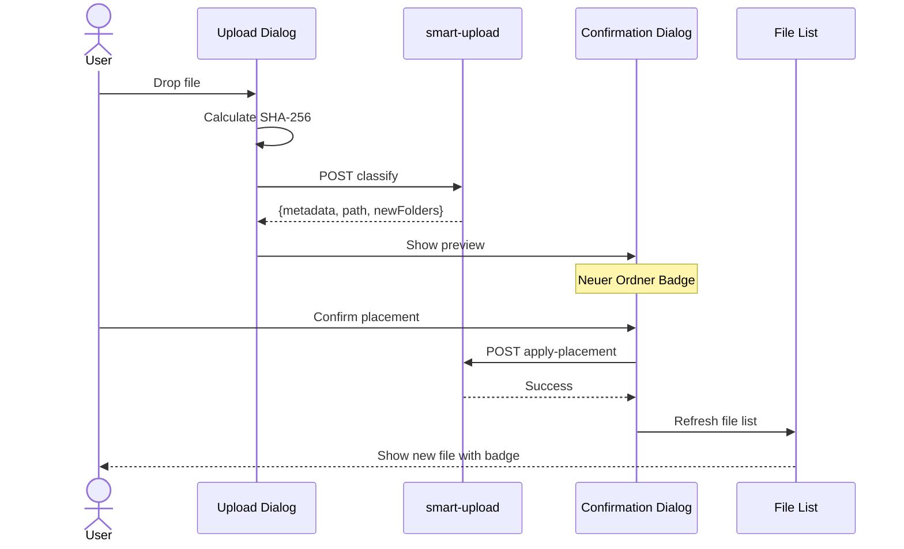

# Software-Dokumentation: Smart Document Storage (MVP)

**Version:** 1.0.0  
**Stand:** 10.10.2025  
**Projekt:** Smarte Dokumentenablage – B2C Cloud-Dokumentenverwaltung

---

## Inhaltsverzeichnis

1. [Einleitung & Überblick](#1-einleitung--überblick)
2. [Systemarchitektur](#2-systemarchitektur)
3. [Daten- & Datenbankdesign](#3-daten--datenbankdesign)
4. [Schnittstellen (API)](#4-schnittstellen-api)
5. [Komponentendesign](#5-komponentendesign)
6. [Benutzeroberfläche (UI/UX)](#6-benutzeroberfläche-uiux)
7. [Anforderungen (Requirements)](#7-anforderungen-requirements)
8. [Annahmen & Abhängigkeiten](#8-annahmen--abhängigkeiten)
9. [Glossar](#9-glossar)
10. [Implementierung & Deployment](#10-implementierung--deployment)

**Anhänge:**
- A. Konfigurationsdateien
- B. Testdokumentation
- C. Deployment Guides
- D. Change Log

---

## 1. Einleitung & Überblick

### 1.1 Dokumentationszweck

Diese Dokumentation beschreibt die technische Implementierung der Smart Document Storage App (MVP). Sie richtet sich an:
- **Entwickler:** Architektur, APIs, Datenmodell
- **QA/Testing:** Akzeptanzkriterien, Testfälle
- **Product Management:** Features, Limits, Roadmap
- **DevOps:** Deployment, Monitoring, Sicherheit
- **Support:** Troubleshooting, Feature-Gating

### 1.2 Projektzusammenfassung

**Vision:** B2C-Web-App für EU-Nutzer (DE/EN), die Dokumente und Bilder in der Cloud speichert und dank **„Smart Upload"** automatisch mit Metadaten versieht und in eine passende Ordnerstruktur einsortiert.

**Kernziele:**
- **Owner-Isolation:** Strikte Datentrennung via RLS (Row Level Security)
- **Security-First:** Signierte URLs, keine öffentlichen Storage-Buckets
- **Office-Preview:** Ohne Drittanbieter (Headless-Konvertierung)
- **Smart Organization:** KI-gestützte Metadatenextraktion + Schema-Mapping

**USP:** Intelligente Ablage, nicht unendlicher Speicher.

### 1.3 Hauptfunktionen (MVP)

- **Ordner & Dateien:** CRUD-Operationen, Hierarchie (max. Tiefe 3), Drag&Drop
- **Smart Upload:** OCR Seite 1 → OpenAI Metadaten → Schema-Mapping → Pfadvorschlag
- **Metadaten:** Titel, doc_type, date, party, amount, Tags (manuell)
- **Ansichten:** Detailliert, Kompakt, Galerie (Basic+)
- **Preview:** Bilder, PDF, Office (DOCX/XLSX/PPTX) via Server-Konvertierung
- **Badges:** "Neue Dateien" pro Ordner + pro Nutzer
- **Duplikate:** SHA-256-basierte Erkennung, Verknüpfung statt Kopie
- **Pläne:** Free/Basic/Plus/Max mit Feature-Gating

---

## 2. Systemarchitektur

### 2.1 High-Level Architektur



### 2.2 Technologie-Stack

| Layer | Technologie | Version | Zweck |
|-------|-------------|---------|-------|
| **Frontend** | React | 18.3.1 | UI Framework |
| | TypeScript | ^5.x | Typsicherheit |
| | Tailwind CSS | ^3.x | Styling (HSL-Tokens) |
| | shadcn/ui | Latest | UI-Komponenten |
| | Framer Motion | ^12.x | Animationen (sparsam) |
| | react-i18next | ^16.x | Lokalisierung DE/EN |
| **Backend** | Supabase | Cloud | Postgres + Auth + Storage |
| | Edge Functions | Deno | Serverless Logic |
| **KI** | Tesseract.js | ^4.x | OCR (Seite 1, lokal) |
| | OpenAI | GPT-4o-mini | Metadatenextraktion |
| **Payments** | Stripe | v3 | Subscriptions + Webhooks |
| **Build** | Vite | ^5.x | Build Tool |

### 2.3 Architektonische Entscheidungen

**Security-First:**
- RLS Owner-Only für alle Tabellen (folders, files, usage_tracking)
- Signierte URLs (5 Min TTL) statt öffentlicher Storage-Buckets
- JWT-basierte Auth via Supabase
- Audit-Logging für kritische Operationen

**Office-Preview ohne Drittanbieter:**
- Headless LibreOffice/Pandoc im Deno-Container → PDF/PNG
- Interner Viewer (keine Office365/Google Drive Embeds)
- Preview-Status: `queued | ready | failed`

**Kostenbremse:**
- OCR nur Seite 1 (Tesseract.js)
- Kompakte OpenAI-Prompts (<200 Tokens)
- Response-Caching für wiederkehrende Layouts
- Plan-basierte Rate-Limits

**Schema-Mapping:**
- Konfigurierbares Ablageschema pro Nutzer (`schema_config`)
- Prospektiv wirksam (neue Uploads)
- Optionaler Reorg-Job für Bestandsdateien (Dry-Run)

---

## 3. Daten- & Datenbankdesign

### 3.1 Entity Relationship Diagram (ERD)



### 3.2 Tabellenschemas

#### 3.2.1 profiles

| Spalte | Typ | Nullable | Default | Beschreibung |
|--------|-----|----------|---------|--------------|
| id | uuid | No | - | PK, FK zu auth.users |
| plan_tier | text | No | 'free' | free/basic/plus/max |
| locale | text | No | 'de' | DE oder EN |
| theme | text | No | 'light' | light/dark/colorful |
| created_at | timestamptz | No | now() | Erstellungszeitpunkt |
| updated_at | timestamptz | No | now() | Letzte Änderung |

**RLS Policies:**
- SELECT: `auth.uid() = id`
- UPDATE: `auth.uid() = id`
- INSERT/DELETE: Verhindert (Trigger-basiert)

#### 3.2.2 folders

| Spalte | Typ | Nullable | Default | Beschreibung |
|--------|-----|----------|---------|--------------|
| id | uuid | No | gen_random_uuid() | PK |
| owner_id | uuid | No | - | FK zu profiles.id |
| parent_id | uuid | Yes | NULL | FK zu folders.id (selbstreferenzierend) |
| name | text | No | - | Ordnername |
| meta | jsonb | Yes | {} | Freitext-Metadaten |
| inherited_meta | jsonb | Yes | {} | Von Parent geerbte Metadaten |
| created_at | timestamptz | No | now() | - |
| updated_at | timestamptz | No | now() | - |

**Constraints:**
- Max. Hierarchie-Tiefe: 3 (Check-Constraint)
- Keine Zirkelreferenzen (Trigger)

**RLS Policies:**
- SELECT/INSERT/UPDATE/DELETE: `auth.uid() = owner_id`

**Indizes:**
- `folders(owner_id, parent_id)`

#### 3.2.3 files

| Spalte | Typ | Nullable | Default | Beschreibung |
|--------|-----|----------|---------|--------------|
| id | uuid | No | gen_random_uuid() | PK |
| owner_id | uuid | No | - | FK zu profiles.id |
| folder_id | uuid | No | - | FK zu folders.id |
| storage_path | text | No | - | Pfad in Supabase Storage |
| mime | text | No | - | MIME-Type |
| size | bigint | No | - | Bytes |
| hash_sha256 | text | No | - | Content-Hash für Duplikate |
| title | text | No | - | Dateititel |
| meta | jsonb | Yes | {} | doc_type, date, party, amount, confidence |
| tags | text[] | Yes | [] | Manuelle Tags |
| preview_state | text | No | 'queued' | queued/ready/failed |
| created_at | timestamptz | No | now() | - |
| updated_at | timestamptz | No | now() | - |

**RLS Policies:**
- SELECT/INSERT/UPDATE/DELETE: `auth.uid() = owner_id`

**Indizes:**
- `files(hash_sha256)` (UNIQUE für Deduplication)
- `files(tags)` GIN (für Array-Suche)
- `files(owner_id, folder_id)`

#### 3.2.4 usage_tracking

| Spalte | Typ | Nullable | Default | Beschreibung |
|--------|-----|----------|---------|--------------|
| id | bigserial | No | - | PK |
| user_id | uuid | No | - | FK zu profiles.id |
| feature | text | No | - | 'smart_upload', 'storage', etc. |
| date | date | No | CURRENT_DATE | Nutzungsdatum |
| count | int | No | 0 | Zähler |
| created_at | timestamptz | No | now() | - |
| updated_at | timestamptz | No | now() | - |

**RLS Policies:**
- SELECT/INSERT/UPDATE: `auth.uid() = user_id`
- DELETE: Verhindert (Audit-Trail)

**Indizes:**
- `usage_tracking(user_id, feature, date)` UNIQUE

### 3.3 Row-Level Security (RLS) Policies

**Grundprinzip:** Owner-Only Isolation

| Tabelle | Operation | Policy | Bedingung |
|---------|-----------|--------|-----------|
| profiles | SELECT | Users can view own profile | `auth.uid() = id` |
| profiles | UPDATE | Users can update own profile | `auth.uid() = id` |
| folders | SELECT | Users can view own folders | `auth.uid() = owner_id` |
| folders | INSERT | Users can create own folders | `auth.uid() = owner_id` |
| folders | UPDATE | Users can update own folders | `auth.uid() = owner_id` |
| folders | DELETE | Users can delete own folders | `auth.uid() = owner_id` |
| files | SELECT | Users can view own files | `auth.uid() = owner_id` |
| files | INSERT | Users can create own files | `auth.uid() = owner_id` |
| files | UPDATE | Users can update own files | `auth.uid() = owner_id` |
| files | DELETE | Users can delete own files | `auth.uid() = owner_id` |
| usage_tracking | SELECT | Users can view own usage | `auth.uid() = user_id` |
| usage_tracking | INSERT/UPDATE | Users can track own usage | `auth.uid() = user_id` |
| shared_links | SELECT (Public) | Public can view valid links | `expires_at > now()` |
| shared_links | SELECT (Owner) | Users can view own links | `auth.uid() = owner_id` |
| audit_log | SELECT | Users/Admins can view logs | `auth.uid() = user_id OR has_role('admin')` |

### 3.4 Datenflüsse

#### Smart Upload Pipeline



---

## 4. Schnittstellen (API)

### 4.1 Edge Functions Übersicht

| Function | Auth | Methode | Input | Output | Beschreibung |
|----------|------|---------|-------|--------|--------------|
| `smart-upload` | JWT | POST | `{fileId, userContext?}` | `{title, meta, folderPath}` | OCR + Metadatenextraktion |
| `generate-signed-url` | JWT | POST | `{fileId, expiresIn?}` | `{signedUrl, expiresAt}` | 5-Min Download-URL |
| `generate-preview` | JWT | POST | `{fileId}` | `{previewPath}` | PDF/Office → PNG |
| `create-share-link` | JWT | POST | `{fileId, expiresInDays?}` | `{token, url, expiresAt}` | Öffentliche Freigabe |
| `get-shared-file` | Public | POST | `{token}` | `{file, signedUrl}` | Zugriff auf geteilte Datei |
| `reset-folder-visit` | JWT | POST | `{folderId}` | `{resetCount}` | Unread-Badge zurücksetzen |
| `create-checkout` | JWT | POST | `{priceId}` | `{checkoutUrl}` | Stripe Checkout Session |
| `customer-portal` | JWT | POST | `{}` | `{portalUrl}` | Stripe Kundenportal |
| `check-subscription` | JWT | POST | `{}` | `{planTier, features}` | Abo-Status prüfen |

### 4.2 Authentifizierung

**Methode:** JWT Bearer Token (Supabase Auth)

```typescript
// Request Header
Authorization: Bearer <supabase_jwt_token>
```

**Token-Quelle:**
```typescript
import { supabase } from '@/integrations/supabase/client';

const { data: { session } } = await supabase.auth.getSession();
const token = session?.access_token;
```

### 4.3 API-Beispiel: smart-upload

**Endpoint:** `https://<project>.supabase.co/functions/v1/smart-upload`

**Request:**
```json
POST /functions/v1/smart-upload
Authorization: Bearer <jwt>
Content-Type: application/json

{
  "fileId": "uuid",
  "userContext": {
    "locale": "de",
    "preferredFolders": ["/Finanzen", "/Verträge"]
  }
}
```

**Response (Success):**
```json
{
  "metadata": {
    "title": "Rechnung Telekom 2025-01",
    "doc_type": "Rechnung",
    "date": "2025-01-15",
    "party": "Telekom",
    "amount": 49.99,
    "confidence": 0.92
  },
  "suggestedPath": "/Finanzen/Rechnung/2025/01",
  "newFolders": [
    { "name": "Finanzen", "exists": true },
    { "name": "Rechnung", "exists": true },
    { "name": "2025", "exists": false },
    { "name": "01", "exists": false }
  ],
  "isDuplicate": false,
  "usage": {
    "smartUploads": 15,
    "limit": 30
  }
}
```

**Response (Limit Exceeded):**
```json
{
  "error": "feature_forbidden",
  "message": "Smart upload limit reached for plan tier 'free'",
  "limit": 30,
  "used": 30,
  "upgradeUrl": "/plans"
}
```

### 4.4 CORS & Rate Limiting

**CORS Headers:**
```typescript
const corsHeaders = {
  'Access-Control-Allow-Origin': '*',
  'Access-Control-Allow-Headers': 'authorization, x-client-info, apikey, content-type',
};
```

**Rate Limits (Plan-basiert):**
- Free: 10 Requests/Min
- Basic: 30 Requests/Min
- Plus: 60 Requests/Min
- Max: 100 Requests/Min

---

## 5. Komponentendesign

### 5.1 Frontend-Architektur

```
src/
├── components/
│   ├── documents/          # Datei-bezogene Components
│   │   ├── DocumentList.tsx
│   │   ├── DocumentPreview.tsx
│   │   ├── DocumentViewer.tsx
│   │   ├── FilterPanel.tsx
│   │   ├── EditTagsDialog.tsx
│   │   └── ShareLinkDialog.tsx
│   ├── folders/           # Ordner-Management
│   │   ├── FolderTree.tsx
│   │   ├── CreateFolderDialog.tsx
│   │   └── FolderBadgeCount.tsx
│   ├── upload/            # Upload-Funktionalität
│   │   ├── FileUpload.tsx
│   │   └── MetadataConfirmDialog.tsx
│   ├── plans/             # Feature-Gating
│   │   ├── PlanCard.tsx
│   │   ├── FeatureGate.tsx
│   │   └── UpgradePrompt.tsx
│   └── ui/                # shadcn/ui Base Components
├── contexts/
│   └── AuthContext.tsx    # Auth State + Profile
├── hooks/
│   ├── useFolders.ts      # Folder CRUD
│   ├── useFiles.ts        # File CRUD
│   └── useSubscription.ts # Stripe Status
├── lib/
│   ├── plans.ts           # Plan-Definitionen
│   └── utils.ts           # Helper-Funktionen
└── pages/
    ├── Index.tsx          # Hauptansicht
    ├── Auth.tsx           # Login/Signup
    ├── Settings.tsx       # Profil & Preferences
    └── public/
        ├── Landing.tsx
        └── Pricing.tsx
```

### 5.2 State Management

**React Query (Server State):**
```typescript
// useFolders.ts
export const useFolders = () => {
  return useQuery({
    queryKey: ['folders'],
    queryFn: async () => {
      const { data, error } = await supabase
        .from('folders')
        .select('*')
        .order('name');
      if (error) throw error;
      return data;
    }
  });
};
```

**Context (Global Client State):**
```typescript
// AuthContext.tsx
export const AuthContext = createContext<{
  user: User | null;
  profile: Profile | null;
  signIn: (email: string, password: string) => Promise<void>;
  signOut: () => Promise<void>;
}>();
```

### 5.3 Custom Hooks

| Hook | Zweck | Methoden/State |
|------|-------|-----------------|
| `useFolders()` | Ordner CRUD + Hierarchie | `{ folders, createFolder, updateFolder, deleteFolder }` |
| `useFiles()` | Datei CRUD + Metadaten | `{ files, uploadFile, updateFile, deleteFile }` |
| `useSubscription()` | Stripe-Status + Portal | `{ plan, features, openPortal }` |
| `useFolderUnreadCounts()` | Badge-Zähler | `{ counts, resetCount }` |
| `useSmartUpload()` | Smart Upload Flow | `{ classify, applyPlacement, usage }` |

---

## 6. Benutzeroberfläche (UI/UX)

### 6.1 Design System

**Themes:** Light, Dark, **Colorful**

**Farbpalette (HSL-basiert):**
```css
/* index.css */
:root {
  --primary: 210 100% 50%;       /* Blau */
  --secondary: 270 80% 60%;      /* Lila */
  --accent: 150 70% 50%;         /* Grün */
  --destructive: 0 85% 60%;      /* Rot */
  --background: 0 0% 100%;       /* Weiß */
  --foreground: 0 0% 10%;        /* Fast-Schwarz */
}

[data-theme="colorful"] {
  --primary: 280 90% 60%;        /* Magenta */
  --secondary: 45 100% 55%;      /* Gelb */
  --accent: 160 80% 45%;         /* Türkis */
  /* Bewusst bunt, aber kontrastreich */
}
```

**Typografie:**
- Font: Inter (System-UI Fallback)
- Größen: xs(12px), sm(14px), base(16px), lg(18px), xl(20px)

### 6.2 User Flow: Smart Upload



### 6.3 Accessibility

- **WCAG AA-konform** (angestrebt)
- **Keyboard-Navigation:** Tab, Enter, Escape
- **i18n:** DE/EN via react-i18next
- **prefers-reduced-motion:** Animationen respektieren
- **ARIA-Labels:** Buttons, Dialogs, Listen
- **Focus-Visible:** Klare Fokus-Indikatoren

---

## 7. Anforderungen (Requirements)

### 7.1 Funktionale Anforderungen

| ID | Feature | Beschreibung | Priorität |
|----|---------|--------------|-----------|
| FR-001 | Ordner CRUD | Erstellen, Umbenennen, Verschieben, Löschen | Must |
| FR-002 | Datei CRUD | Upload, Umbenennen, Verschieben, Löschen, Download | Must |
| FR-003 | Smart Upload | OCR + KI-Metadaten + Schema-Mapping | Must |
| FR-004 | Duplikate | SHA-256 Erkennung, Verknüpfung statt Kopie | Must |
| FR-005 | Metadaten | Titel, doc_type, date, party, amount, Tags | Must |
| FR-006 | Preview | Bilder, PDF, Office (Server-Konvertierung) | Must |
| FR-007 | Ansichten | Detailliert, Kompakt, Galerie (Basic+) | Must |
| FR-008 | Badges | "Neue Dateien" pro Ordner + pro Nutzer | Must |
| FR-009 | Suche/Filter | Titel, Tags, MIME, Datum, Ordner | Must |
| FR-010 | Freigabe | Read-Only-Links mit Token + Expiry | Should |
| FR-011 | Schema-Config | Anpassbares Ablageschema | Should |

### 7.2 Nicht-funktionale Anforderungen

| ID | Kategorie | Anforderung | Messgröße |
|----|-----------|-------------|-----------|
| NFR-001 | Performance | LCP (Largest Contentful Paint) | < 2s |
| NFR-002 | Performance | TTI (Time to Interactive) | < 3s |
| NFR-003 | Performance | Smart Upload Pipeline | < 8s |
| NFR-004 | Security | RLS Owner-Isolation | 100% Coverage |
| NFR-005 | Security | Signed URLs TTL | 5 Min |
| NFR-006 | Availability | Uptime | > 99.5% |
| NFR-007 | Usability | Clicks to Smart Upload | < 5 |
| NFR-008 | Scalability | Concurrent Users | > 10.000 |

### 7.3 Plan-Limits

| Plan | Smart-Uploads/Mon | Speicher | Max. Dateigröße | Features |
|------|-------------------|----------|-----------------|----------|
| Free | 30 | 5 GB | 25 MB | Previews, 2 Ansichten, Badges |
| Basic | 300 | 50 GB | 250 MB | + Galerie, Massenupload |
| Plus | 1.500 | 200 GB | 1 GB | + Versionsverlauf 30d |
| Max | 5.000 | 1 TB | 2 GB | + Versionsverlauf 180d |

---

## 8. Annahmen & Abhängigkeiten

### 8.1 Technische Annahmen

- **Supabase Verfügbarkeit:** 99.9% (SLA)
- **OpenAI API:** Rate-Limits nicht erreicht (Kostenbremse aktiv)
- **OCR-Qualität:** > 90% bei gescannten Dokumenten
- **Browser-Support:** ES2020+ (Chrome, Firefox, Safari, Edge letzte 2 Versionen)

### 8.2 Business Annahmen

- **User-Verhalten:** < 50 Smart-Uploads/Monat (Free), < 10 GB Storage
- **Wachstum:** Lineare Skalierung via Stripe + Supabase Auto-Scale
- **DSGVO:** EU-Region (Supabase Frankfurt)
- **Support:** Selbstbedienung via Docs + In-App-Hilfe

### 8.3 Abhängigkeiten

| Komponente | Typ | Risiko | Mitigation |
|------------|-----|--------|------------|
| Stripe | Critical | API-Ausfall | Fallback: Upgrade-Queue |
| OpenAI | High | Rate-Limit/Kosten | Kostenbremse, Caching |
| Supabase | Critical | DB/Storage-Ausfall | Backups, PITR |
| Lovable Cloud | Medium | CI/CD-Ausfall | Manueller Deploy-Fallback |

---

## 9. Glossar

### 9.1 Business-Begriffe

- **Smart Upload:** KI-gestützte Metadatenextraktion + Ordnervorschlag
- **Owner-Isolation:** Strikte RLS-Trennung zwischen Usern
- **Schema-Mapping:** Regelbasierte Pfadvorschläge (prospektiv)
- **Duplikat-Verknüpfung:** SHA-256-basiert, keine Kopien
- **Unread-Badge:** "Neue Dateien" pro Ordner + Hierarchie
- **Feature-Gating:** Plan-basierte Feature-Freischaltung

### 9.2 Technische Begriffe

- **RLS:** Row Level Security (Postgres)
- **Signierte URLs:** Zeitlich begrenzte Storage-Zugriffe (5 Min TTL)
- **Edge Functions:** Supabase Serverless Functions (Deno Runtime)
- **OCR:** Optical Character Recognition (Tesseract.js)
- **JWT:** JSON Web Token (Supabase Auth)
- **HSL:** Hue, Saturation, Lightness (CSS-Farbmodell)

### 9.3 Akronyme

- **MVP:** Minimum Viable Product
- **DSGVO:** Datenschutz-Grundverordnung
- **TTL:** Time To Live (URL-Gültigkeit)
- **LCP:** Largest Contentful Paint
- **TTI:** Time to Interactive
- **PITR:** Point-in-Time Recovery
- **APM:** Application Performance Monitoring

---

## 10. Implementierung & Deployment

### 10.1 Development Workflow

- **Lovable Cloud:** CI/CD mit Auto-Deploy
- **Git:** Feature-Branches (optional bei GitHub-Sync)
- **Testing:** Playwright (E2E), Vitest (Unit)
- **Migrations:** Versioniert via `supabase/migrations/`

### 10.2 Deployment Pipeline

**Environments:**
- Development: Lovable Preview
- Production: lovable.app Domain

**CI/CD-Flow:**
1. Code-Änderung → Auto-Deploy
2. Migrations → DB-Schema-Update
3. Edge Functions → Deno-Deploy
4. Tests → E2E + Unit

**Rollback:**
- Lovable Version History
- DB-Migrations: Revert-Scripts
- Edge Functions: Canary-Releases

### 10.3 Monitoring

| Kategorie | Metriken | Tool |
|-----------|----------|------|
| APM | Latency, Errors, Throughput | Lovable Cloud |
| DB | Query Time, Connections, Size | Supabase Dashboard |
| Edge | Invocations, Duration, Errors | Supabase Logs |
| Kosten | OpenAI Tokens, Stripe Revenue, Storage GB | Custom Dashboards |

### 10.4 Backups & Recovery

- **Datenbank:** Tägliche Backups + PITR (Point-in-Time Recovery)
- **Storage:** Redundanz via Supabase (S3-backed)
- **Migrations:** Git-versioniert, Revert-fähig
- **RTO:** < 4 Stunden (Recovery Time Objective)
- **RPO:** < 1 Stunde (Recovery Point Objective)

---

## Anhang A: Konfigurationsdateien

### A.1 tailwind.config.ts

```typescript
export default {
  theme: {
    extend: {
      colors: {
        primary: 'hsl(var(--primary))',
        secondary: 'hsl(var(--secondary))',
        accent: 'hsl(var(--accent))',
        // ...
      }
    }
  }
}
```

### A.2 package.json (Auszug)

```json
{
  "dependencies": {
    "react": "^18.3.1",
    "@supabase/supabase-js": "^2.74.0",
    "react-i18next": "^16.0.0",
    "framer-motion": "^12.23.22"
  }
}
```

---

## Anhang B: Testdokumentation

### B.1 E2E-Tests (Playwright)

| Test | Datei | Szenario |
|------|-------|----------|
| Auth | `auth.spec.ts` | Signup, Login, Logout |
| Upload | `upload.spec.ts` | Manuell, Smart Upload, Duplikat |
| Owner-Isolation | `owner-isolation.spec.ts` | Cross-Tenant-Block |
| Feature-Gating | `feature-gating.spec.ts` | Plan-Limit-Enforcement |

### B.2 Unit-Tests (Vitest)

- `plans.test.ts`: Plan-Limit-Checks
- `utils.test.ts`: Helper-Funktionen
- `auth.test.ts`: Auth-Context-Logic

---

## Anhang C: Deployment Guides

### C.1 Lovable Cloud (Standard)

1. Code-Änderung → Auto-Deploy via Lovable CI/CD
2. Migrations → Automatisch ausgeführt
3. Edge Functions → Automatisch deployed

### C.2 Manueller Deploy (Fallback)

```bash
# DB Migrations
supabase db push

# Edge Functions
supabase functions deploy smart-upload
supabase functions deploy generate-signed-url
# ...
```

---

## Anhang D: Change Log

**Version:** 1.0.0 (MVP)  
**Letztes Update:** 10.10.2025  

**Detaillierter Implementierungsverlauf:** Siehe `PROGRESS_LOG.md`

**Wichtigste Meilensteine:**
- ✅ Lovable Cloud aktiviert
- ✅ DB-Schema mit RLS
- ✅ Smart Upload Pipeline
- ✅ Feature-Gating (Pläne)
- ✅ Stripe-Integration
- ✅ Office-Preview
- ✅ Badge-System

---

**Ende der Dokumentation**
