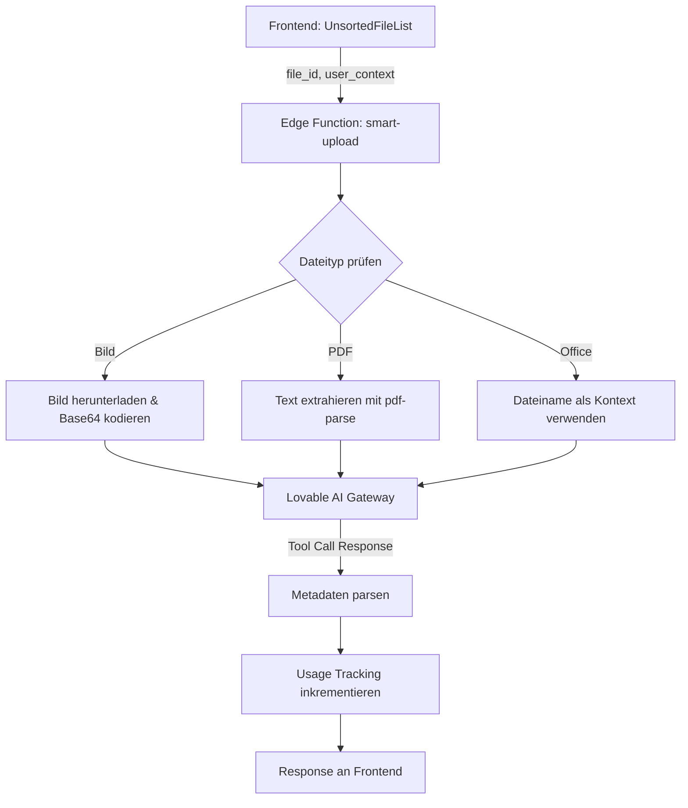
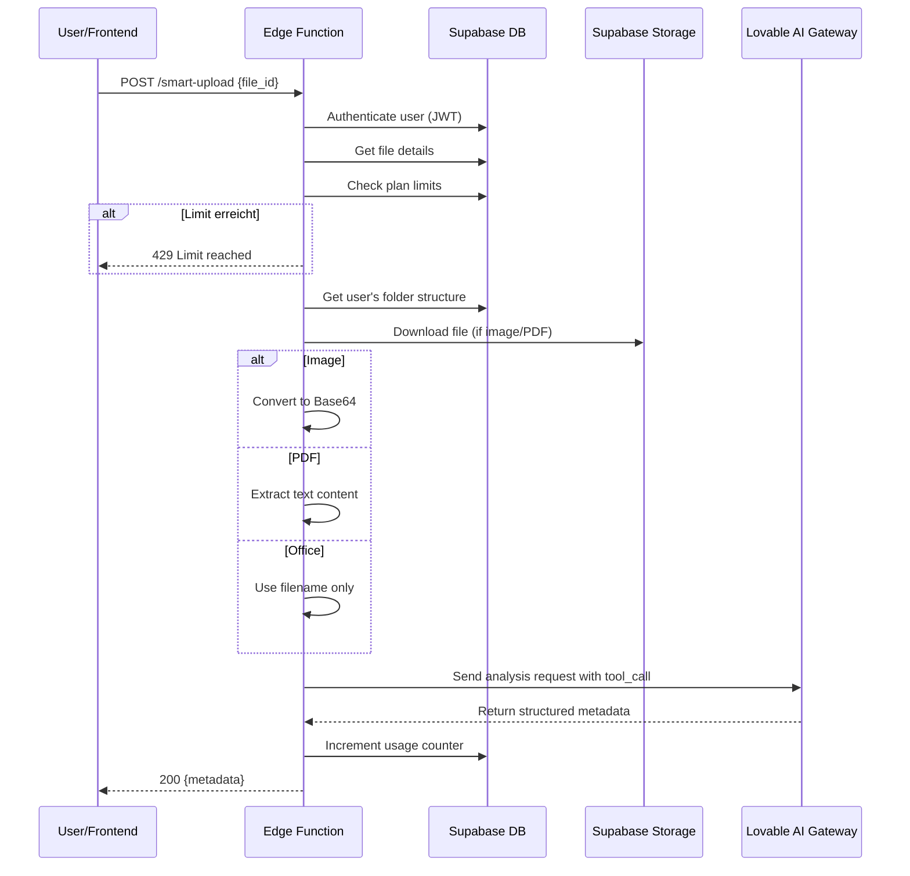

# Smart Upload – Technische Dokumentation

## Übersicht

Der Smart Upload ist eine KI-gestützte Funktion zur automatischen Metadaten-Extraktion und intelligenten Ablage von Dokumenten. Die Funktion analysiert hochgeladene Dateien und schlägt automatisch Titel, Schlagwörter, Dokumenttyp und Ablageort vor.

## Architektur



## Technologie-Stack

| Komponente | Technologie |
|------------|-------------|
| AI Gateway | Lovable AI Gateway (`https://ai.gateway.lovable.dev/v1/chat/completions`) |
| AI Modell | `google/gemini-2.5-flash` |
| PDF-Parsing | Interner Text-Extraktor |
| Speicher | Supabase Storage (Bucket: `documents`) |
| Datenbank | Supabase PostgreSQL |

---

## Input-Parameter

Die Edge Function erwartet folgende Parameter im Request Body:

```typescript
interface SmartUploadRequest {
  file_id: string;           // Required: UUID der Datei in der files-Tabelle
  user_context?: string;     // Optional: Zusätzlicher Kontext vom Benutzer
  skip_document_analysis?: boolean;  // Optional: Nur Metadaten verwenden, keine KI-Analyse
  document_type_hint?: string;       // Optional: Vorab gewählter Dokumenttyp
}
```

### Parameter-Details

| Parameter | Typ | Required | Beschreibung |
|-----------|-----|----------|--------------|
| `file_id` | UUID | ✅ | Referenz zur Datei in der `files`-Tabelle |
| `user_context` | string | ❌ | Freitext-Kontext für bessere Klassifizierung |
| `skip_document_analysis` | boolean | ❌ | Bei `true` wird nur der Dateiname analysiert |
| `document_type_hint` | string | ❌ | Vorselektierter Dokumenttyp (z.B. "insurance", "invoice") |

---

## Ordnerstruktur-Integration

### Abfrage der existierenden Ordner

Die komplette Ordnerstruktur des Benutzers wird vor der KI-Analyse abgefragt:

```sql
SELECT id, name, parent_id, meta 
FROM folders 
WHERE owner_id = {user_id}
```

### Hierarchische Text-Repräsentation

Die Ordner werden in eine hierarchische Text-Struktur umgewandelt:

```typescript
function buildFolderTree(folders: Folder[], parentId: string | null = null, depth: number = 0): string {
  let result = '';
  const children = folders.filter(f => f.parent_id === parentId);
  
  for (const folder of children) {
    const indent = '  '.repeat(depth);
    result += `${indent}- ${folder.name}\n`;
    result += buildFolderTree(folders, folder.id, depth + 1);
  }
  
  return result;
}
```

### Beispiel-Output der Ordnerstruktur

```
EXISTING FOLDER STRUCTURE:
- Versicherungen
  - KFZ
  - Hausrat
  - Leben
- Finanzen
  - Kontoauszüge
  - Steuererklärungen
- Verträge
  - Mobilfunk
  - Internet
- Persönlich
  - Gesundheit
  - Ausweise
```

### Kritische Regeln für die KI

Folgende 5 Regeln werden der KI als Kontext mitgegeben:

```
CRITICAL FOLDER RULES:
1. ALWAYS prefer existing folders over creating new ones
2. If a suitable folder exists, use it EXACTLY as named
3. Only suggest new folders if no existing folder fits
4. Keep folder depth reasonable (1-6 levels maximum)
5. Use the EXACT spelling and case of existing folders
```

---

## Exakte KI-Prompts

### System-Prompt (Basis)

Der System-Prompt wird dynamisch basierend auf der Benutzersprache generiert:

#### Deutsch (locale: "de")

```
Du bist ein intelligenter Dokumenten-Assistent. Analysiere das hochgeladene Dokument und extrahiere relevante Metadaten.

Antworte IMMER auf Deutsch.

Wichtige Regeln:
- Erstelle präzise, beschreibende Titel (max. 60 Zeichen)
- Extrahiere 3-5 relevante Schlagwörter
- Schlage einen logischen Ablageort vor (z.B. "Versicherungen/KFZ" oder "Finanzen/Steuern/2024")
- Erkenne den Dokumenttyp (Rechnung, Vertrag, Versicherung, etc.)
```

#### Englisch (locale: "en")

```
You are an intelligent document assistant. Analyze the uploaded document and extract relevant metadata.

ALWAYS respond in English.

Important rules:
- Create precise, descriptive titles (max 60 characters)
- Extract 3-5 relevant keywords
- Suggest a logical storage path (e.g. "Insurance/Car" or "Finance/Taxes/2024")
- Identify the document type (invoice, contract, insurance, etc.)
```

### User-Prompt für Bilder

```typescript
const userPrompt = `Analyze this image and extract document metadata.

${userContext ? `User context: ${userContext}` : ''}
${documentTypeHint ? `Document type hint: ${documentTypeHint}` : ''}
${documentTypeContext ? `\n${documentTypeContext}` : ''}

${folderStructureText}

Based on the image content, determine:
1. A descriptive title for this document
2. Relevant keywords (3-5)
3. The document type
4. A suggested folder path for storage`;
```

### User-Prompt für PDFs

```typescript
const userPrompt = `Analyze this PDF document and extract metadata.

Document filename: ${file.title}
${userContext ? `User context: ${userContext}` : ''}
${documentTypeHint ? `Document type hint: ${documentTypeHint}` : ''}
${documentTypeContext ? `\n${documentTypeContext}` : ''}

Extracted text content (first 3000 characters):
${extractedText.substring(0, 3000)}

${folderStructureText}

Based on the document content, determine:
1. A descriptive title for this document
2. Relevant keywords (3-5)
3. The document type
4. A suggested folder path for storage`;
```

### User-Prompt für Office-Dokumente (Metadata-Only Mode)

Bei Office-Dokumenten ohne Textextraktion:

```typescript
const userPrompt = `Analyze this document based on its filename and metadata.

Document filename: ${file.title}
File type: ${file.mime}
${userContext ? `User context: ${userContext}` : ''}
${documentTypeHint ? `Document type hint: ${documentTypeHint}` : ''}
${documentTypeContext ? `\n${documentTypeContext}` : ''}

${folderStructureText}

Based on the filename and any provided context, suggest:
1. A descriptive title for this document
2. Relevant keywords (3-5)
3. The document type
4. A suggested folder path for storage`;
```

---

## Tool-Call Schema

Die KI verwendet einen strukturierten Tool-Call für die Antwort:

### Function Definition

```json
{
  "type": "function",
  "function": {
    "name": "extract_document_metadata",
    "description": "Extract and return structured metadata from the analyzed document",
    "parameters": {
      "type": "object",
      "properties": {
        "suggested_title": {
          "type": "string",
          "description": "A descriptive title for the document (max 60 characters)"
        },
        "keywords": {
          "type": "array",
          "items": { "type": "string" },
          "description": "3-5 relevant keywords describing the document content"
        },
        "document_type": {
          "type": "string",
          "description": "The type of document (e.g., invoice, contract, insurance, receipt, letter, report, certificate, photo, other)"
        },
        "suggested_path": {
          "type": "string",
          "description": "Suggested folder path for storage (e.g., 'Insurance/Car' or 'Finance/Taxes/2024')"
        }
      },
      "required": ["suggested_title", "keywords", "document_type", "suggested_path"]
    }
  }
}
```

### Tool Choice

```json
{
  "type": "function",
  "function": { "name": "extract_document_metadata" }
}
```

### Beispiel-Response

```json
{
  "suggested_title": "KFZ-Versicherung Allianz 2024",
  "keywords": ["KFZ", "Versicherung", "Allianz", "Haftpflicht", "2024"],
  "document_type": "Versicherungspolice",
  "suggested_path": "Versicherungen/KFZ/Allianz"
}
```

---

## Dokumenttyp-Kontexte

Jeder Dokumenttyp hat spezifische Kontextinformationen für die KI:

### Verfügbare Dokumenttypen

| Key | Label (DE) | Label (EN) |
|-----|------------|------------|
| `insurance` | Versicherung | Insurance |
| `contract` | Vertrag | Contract |
| `invoice` | Rechnung | Invoice |
| `receipt` | Quittung/Beleg | Receipt |
| `tax` | Steuer | Tax |
| `bank` | Bank/Finanzen | Bank/Finance |
| `health` | Gesundheit | Health |
| `education` | Bildung | Education |
| `work` | Arbeit/Beruf | Work/Career |
| `property` | Immobilie | Property |
| `vehicle` | Fahrzeug | Vehicle |
| `travel` | Reise | Travel |
| `personal` | Persönlich | Personal |
| `other` | Sonstiges | Other |

### Dokumenttyp-Kontext Beispiele

#### Versicherung (`insurance`)

```
DOCUMENT TYPE CONTEXT - Insurance:
- Title format: "[Insurance Type] [Provider] [Year]" (e.g., "KFZ-Versicherung Allianz 2024")
- Keywords to extract: insurance type, provider, policy number, coverage period
- Suggested folder structure: Versicherungen/[Type]/[Provider]
```

#### Rechnung (`invoice`)

```
DOCUMENT TYPE CONTEXT - Invoice:
- Title format: "[Vendor] Rechnung [Date/Number]" (e.g., "Amazon Rechnung 2024-03-15")
- Keywords to extract: vendor, amount, date, invoice number, items
- Suggested folder structure: Rechnungen/[Year]/[Category or Vendor]
```

#### Vertrag (`contract`)

```
DOCUMENT TYPE CONTEXT - Contract:
- Title format: "[Contract Type] [Provider/Party] [Year]" (e.g., "Mietvertrag Hauptstraße 5 2023")
- Keywords to extract: contract type, parties, start date, duration, key terms
- Suggested folder structure: Verträge/[Type]/[Provider]
```

#### Steuer (`tax`)

```
DOCUMENT TYPE CONTEXT - Tax:
- Title format: "[Tax Type] [Year]" (e.g., "Einkommensteuerbescheid 2023")
- Keywords to extract: tax year, tax type, amount, reference number
- Suggested folder structure: Steuern/[Year]/[Type]
```

#### Bank/Finanzen (`bank`)

```
DOCUMENT TYPE CONTEXT - Bank/Finance:
- Title format: "[Bank] [Document Type] [Period]" (e.g., "Sparkasse Kontoauszug März 2024")
- Keywords to extract: bank name, account type, period, transactions
- Suggested folder structure: Finanzen/[Bank]/[Document Type]
```

#### Gesundheit (`health`)

```
DOCUMENT TYPE CONTEXT - Health:
- Title format: "[Provider/Type] [Date]" (e.g., "Arztbericht Dr. Müller 2024-03")
- Keywords to extract: provider, type of document, date, diagnosis/treatment
- Suggested folder structure: Gesundheit/[Type]/[Provider]
```

---

## Vollständiger API-Request

### Request an Lovable AI Gateway

```typescript
const response = await fetch('https://ai.gateway.lovable.dev/v1/chat/completions', {
  method: 'POST',
  headers: {
    'Authorization': `Bearer ${LOVABLE_API_KEY}`,
    'Content-Type': 'application/json',
  },
  body: JSON.stringify({
    model: 'google/gemini-2.5-flash',
    messages: [
      { role: 'system', content: systemPrompt },
      { 
        role: 'user', 
        content: isImage 
          ? [
              { type: 'text', text: userPrompt },
              { type: 'image_url', image_url: { url: `data:${file.mime};base64,${base64Image}` } }
            ]
          : userPrompt
      }
    ],
    tools: [extractDocumentMetadataTool],
    tool_choice: { type: 'function', function: { name: 'extract_document_metadata' } }
  })
});
```

### Response-Verarbeitung

```typescript
const data = await response.json();
const toolCall = data.choices[0]?.message?.tool_calls?.[0];

if (toolCall?.function?.arguments) {
  const metadata = JSON.parse(toolCall.function.arguments);
  // metadata enthält: suggested_title, keywords, document_type, suggested_path
}
```

---

## Usage-Tracking & Limits

### Plan-basierte Limits

| Plan | Smart Uploads/Monat |
|------|---------------------|
| Free | 5 |
| Basic | 50 |
| Plus | 200 |
| Max | Unlimited |

### Tracking-Tabelle

```sql
-- usage_tracking Tabelle
CREATE TABLE usage_tracking (
  id SERIAL PRIMARY KEY,
  user_id UUID NOT NULL,
  feature VARCHAR NOT NULL,  -- 'smart_upload'
  date DATE NOT NULL DEFAULT CURRENT_DATE,
  count INTEGER NOT NULL DEFAULT 0,
  created_at TIMESTAMP DEFAULT NOW(),
  updated_at TIMESTAMP DEFAULT NOW()
);
```

### Limit-Prüfung

```typescript
const { remaining } = await checkSmartUploadLimit(supabase, userId, planTier);

if (remaining <= 0) {
  return new Response(
    JSON.stringify({ 
      error: 'Smart upload limit reached',
      limit_reached: true 
    }),
    { status: 429 }
  );
}
```

### Usage-Inkrementierung

Nach erfolgreicher Verarbeitung:

```typescript
await incrementSmartUploadUsage(supabase, userId);
```

---

## Fehlerbehandlung

### HTTP Status Codes

| Code | Bedeutung | Handling |
|------|-----------|----------|
| 200 | Erfolg | Metadaten werden zurückgegeben |
| 400 | Bad Request | Fehlende oder ungültige Parameter |
| 401 | Unauthorized | Ungültiger oder fehlender Auth-Token |
| 402 | Payment Required | Lovable AI Credits erschöpft |
| 404 | Not Found | Datei nicht gefunden |
| 429 | Too Many Requests | Rate Limit oder Plan-Limit erreicht |
| 500 | Server Error | Interner Fehler |

### Fehler-Response Format

```json
{
  "error": "Fehlerbeschreibung",
  "limit_reached": true,  // Optional: bei Limit-Überschreitung
  "details": "..."        // Optional: zusätzliche Details
}
```

### Fallback-Mechanismen

1. **PDF-Textextraktion fehlgeschlagen**: Fallback auf Dateiname-Analyse
2. **KI-Response ungültig**: Fallback auf generische Metadaten
3. **Bild zu groß**: Komprimierung vor Analyse

---

## Sequenzdiagramm



---

## Frontend-Integration

### Aufruf aus UnsortedFileList

```typescript
const processSmartUpload = async (fileId: string, userContext?: string) => {
  const { data, error } = await supabase.functions.invoke('smart-upload', {
    body: {
      file_id: fileId,
      user_context: userContext,
      skip_document_analysis: skipAiAnalysis,
      document_type_hint: selectedDocumentType
    }
  });

  if (error) {
    toast.error('Smart Upload fehlgeschlagen');
    return null;
  }

  return {
    suggestedTitle: data.suggested_title,
    suggestedPath: data.suggested_path,
    keywords: data.keywords,
    documentType: data.document_type
  };
};
```

### Batch-Verarbeitung

Bei "Alle sortieren" werden alle Dateien sequentiell verarbeitet:

```typescript
const processAllFiles = async (files: File[]) => {
  for (const file of files) {
    setProgress(`${processed + 1} von ${files.length}...`);
    await processSmartUpload(file.id);
    processed++;
  }
};
```

---

## Konfiguration

### Environment Variables

| Variable | Beschreibung |
|----------|--------------|
| `LOVABLE_API_KEY` | API-Key für Lovable AI Gateway (automatisch verfügbar) |
| `SUPABASE_URL` | Supabase Project URL |
| `SUPABASE_SERVICE_ROLE_KEY` | Service Role Key für Admin-Zugriff |

### config.toml

```toml
[functions.smart-upload]
verify_jwt = true
```

---

## Changelog

| Version | Datum | Änderungen |
|---------|-------|------------|
| 1.0 | 2024-01 | Initiale Implementierung |
| 1.1 | 2024-02 | Ordnerstruktur-Integration hinzugefügt |
| 1.2 | 2024-03 | Skip-Document-Analysis Mode |
| 1.3 | 2024-04 | Document-Type-Hint Support |
