# Smart Upload System – n8n Integration

## Softwaredokumentation für Telegram + SharePoint + Excel + AI

**Version:** 1.0  
**Stand:** 2025-01-09  
**Zielplattform:** n8n Workflow Automation

---

## 1. Systemübersicht


---

## 2. Datei-Metadaten (Datenmodell)

### 2.1 Vollständiges Metadaten-Schema

| Feld | Typ | Pflicht | Beschreibung | Beispiel |
|------|-----|---------|--------------|----------|
| `id` | UUID | ✅ | Eindeutige Datei-ID | `550e8400-e29b-41d4-a716-446655440000` |
| `owner_id` | UUID | ✅ | Benutzer-ID des Eigentümers | `user_abc123` |
| `folder_id` | UUID | ✅ | ID des Zielordners | `folder_xyz789` |
| `title` | String | ✅ | Anzeigename der Datei | `Rechnung_Telekom_2024-01.pdf` |
| `storage_path` | String | ✅ | Vollständiger Speicherpfad | `/Finanzen/Rechnungen/2024/01/...` |
| `mime` | String | ✅ | MIME-Type der Datei | `application/pdf` |
| `size` | Integer | ✅ | Dateigröße in Bytes | `245789` |
| `hash_sha256` | String | ✅ | SHA-256 Hash für Duplikaterkennung | `a7ffc6f8bf1ed76651c...` |
| `document_type` | String | ❌ | Dokumentkategorie | `invoice` |
| `tags` | Array | ❌ | Schlagwörter | `["telekom", "januar", "mobilfunk"]` |
| `preview_state` | String | ✅ | Status der Vorschau | `queued` \| `ready` \| `failed` |
| `meta` | JSON | ❌ | Erweiterte Metadaten | siehe 2.2 |
| `created_at` | Timestamp | ✅ | Erstellungszeitpunkt | `2024-01-15T10:30:00Z` |
| `updated_at` | Timestamp | ✅ | Letzte Änderung | `2024-01-15T10:30:00Z` |

### 2.2 Erweiterte Metadaten (JSON `meta`-Feld)

```json
{
  "original_name": "IMG_20240115_103045.jpg",
  "uploaded_at": "2024-01-15T10:30:45Z",
  "source": "telegram",
  "telegram_file_id": "AgACAgIAAxkBAAI...",
  "telegram_chat_id": "123456789",
  
  "doc_type": "invoice",
  "date": "2024-01-10",
  "party": "Deutsche Telekom AG",
  "amount": 49.99,
  "currency": "EUR",
  "invoice_number": "RE-2024-001234",
  
  "smart_upload": true,
  "ai_model": "google/gemini-2.5-flash",
  "ai_confidence": 0.95,
  "ai_suggested_path": "/Finanzen/Rechnungen/Telekom/2024/01",
  "ai_suggested_title": "Rechnung_Telekom_2024-01-10.pdf",
  "ai_keywords": ["telekom", "mobilfunk", "rechnung", "januar"],
  "ai_processed_at": "2024-01-15T10:31:02Z",
  
  "user_confirmed": true,
  "user_modified_path": false,
  "user_modified_title": false
}
```

### 2.3 Excel-Mapping für n8n

| Excel-Spalte | Metadaten-Feld | Format | Beispiel |
|--------------|----------------|--------|----------|
| A: `ID` | `id` | Text | `550e8400-e29b...` |
| B: `Dateiname` | `title` | Text | `Rechnung_Telekom.pdf` |
| C: `Dokumenttyp` | `document_type` | Text | `invoice` |
| D: `Speicherpfad` | `storage_path` | Text | `/Finanzen/Rechnungen/...` |
| E: `Datum` | `meta.date` | Datum | `2024-01-10` |
| F: `Partei` | `meta.party` | Text | `Deutsche Telekom AG` |
| G: `Betrag` | `meta.amount` | Währung | `49,99 €` |
| H: `Tags` | `tags` (joined) | Text | `telekom, januar, mobilfunk` |
| I: `Größe (KB)` | `size / 1024` | Zahl | `240` |
| J: `MIME-Type` | `mime` | Text | `application/pdf` |
| K: `Hash` | `hash_sha256` | Text | `a7ffc6f8bf1ed...` |
| L: `Erstellt` | `created_at` | Datum/Zeit | `15.01.2024 10:30` |
| M: `KI-Modell` | `meta.ai_model` | Text | `gemini-2.5-flash` |
| N: `KI-Konfidenz` | `meta.ai_confidence` | Prozent | `95%` |
| O: `Quelle` | `meta.source` | Text | `telegram` |
| P: `Original-Name` | `meta.original_name` | Text | `IMG_20240115.jpg` |

---

## 3. Smart Upload API-Spezifikation

### 3.1 API-Request (an AI Gateway)

**Endpoint:**
```
POST https://ai.gateway.lovable.dev/v1/chat/completions
```

**Headers:**
```http
Authorization: Bearer <LOVABLE_AI_API_KEY>
Content-Type: application/json
```

**Request Body:**
```json
{
  "model": "google/gemini-2.5-flash",
  "messages": [
    {
      "role": "system",
      "content": "Du bist ein Dokumenten-Klassifizierungssystem. Analysiere das Dokument und extrahiere strukturierte Metadaten.\n\nVerfügbare Dokumenttypen:\n- invoice (Rechnung)\n- contract (Vertrag)\n- letter (Brief/Schreiben)\n- id_document (Ausweis/Pass)\n- certificate (Zertifikat/Bescheinigung)\n- tax_document (Steuerdokument)\n- insurance (Versicherung)\n- bank_statement (Kontoauszug)\n- payslip (Gehaltsabrechnung)\n- photo (Foto)\n- receipt (Kassenbon)\n- warranty (Garantie)\n- manual (Anleitung)\n- other (Sonstiges)\n\nBestehende Ordnerstruktur:\n/Finanzen\n  /Rechnungen\n    /Telekom\n    /Strom\n  /Steuern\n/Verträge\n/Dokumente\n  /Ausweise\n  /Zertifikate\n/Fotos\n  /2024\n  /2023\n\nRegeln:\n1. Nutze bestehende Ordner wenn passend\n2. Erstelle neue Unterordner nur wenn nötig\n3. Pfadformat: /{Bereich}/{Kategorie}/{Jahr}/{Monat}\n4. Titel ohne Sonderzeichen, mit Datum wenn vorhanden"
    },
    {
      "role": "user",
      "content": [
        {
          "type": "text",
          "text": "Analysiere dieses Dokument und extrahiere die Metadaten."
        },
        {
          "type": "image_url",
          "image_url": {
            "url": "data:image/jpeg;base64,/9j/4AAQSkZJRgABAQAAAQABAAD..."
          }
        }
      ]
    }
  ],
  "tools": [
    {
      "type": "function",
      "function": {
        "name": "extract_metadata",
        "description": "Extrahiert strukturierte Metadaten aus einem Dokument",
        "parameters": {
          "type": "object",
          "properties": {
            "document_type": {
              "type": "string",
              "enum": ["invoice", "contract", "letter", "id_document", "certificate", "tax_document", "insurance", "bank_statement", "payslip", "photo", "receipt", "warranty", "manual", "other"],
              "description": "Klassifizierung des Dokumenttyps"
            },
            "suggested_title": {
              "type": "string",
              "description": "Vorgeschlagener Dateiname (ohne Erweiterung)"
            },
            "suggested_path": {
              "type": "string",
              "description": "Vorgeschlagener Ablageordner"
            },
            "keywords": {
              "type": "array",
              "items": { "type": "string" },
              "description": "Relevante Schlagwörter (3-5)"
            },
            "date": {
              "type": "string",
              "description": "Dokumentdatum im Format YYYY-MM-DD"
            },
            "party": {
              "type": "string",
              "description": "Beteiligte Partei/Firma"
            },
            "amount": {
              "type": "number",
              "description": "Geldbetrag falls vorhanden"
            },
            "currency": {
              "type": "string",
              "description": "Währung (EUR, USD, etc.)"
            },
            "reference_number": {
              "type": "string",
              "description": "Referenz-/Rechnungsnummer"
            },
            "confidence": {
              "type": "number",
              "minimum": 0,
              "maximum": 1,
              "description": "Konfidenz der Klassifizierung"
            }
          },
          "required": ["document_type", "suggested_title", "suggested_path", "keywords", "confidence"]
        }
      }
    }
  ],
  "tool_choice": {
    "type": "function",
    "function": { "name": "extract_metadata" }
  },
  "max_tokens": 500
}
```

### 3.2 API-Response (von AI)

```json
{
  "id": "chatcmpl-abc123",
  "object": "chat.completion",
  "created": 1705312262,
  "model": "google/gemini-2.5-flash",
  "choices": [
    {
      "index": 0,
      "message": {
        "role": "assistant",
        "content": null,
        "tool_calls": [
          {
            "id": "call_xyz789",
            "type": "function",
            "function": {
              "name": "extract_metadata",
              "arguments": "{\"document_type\":\"invoice\",\"suggested_title\":\"Rechnung_Telekom_2024-01-10\",\"suggested_path\":\"/Finanzen/Rechnungen/Telekom/2024/01\",\"keywords\":[\"telekom\",\"mobilfunk\",\"rechnung\",\"januar\",\"2024\"],\"date\":\"2024-01-10\",\"party\":\"Deutsche Telekom AG\",\"amount\":49.99,\"currency\":\"EUR\",\"reference_number\":\"RE-2024-001234\",\"confidence\":0.95}"
            }
          }
        ]
      },
      "finish_reason": "tool_calls"
    }
  ],
  "usage": {
    "prompt_tokens": 1250,
    "completion_tokens": 85,
    "total_tokens": 1335
  }
}
```

### 3.3 Geparste Metadaten

Nach dem Parsing der API-Response:

```json
{
  "document_type": "invoice",
  "suggested_title": "Rechnung_Telekom_2024-01-10",
  "suggested_path": "/Finanzen/Rechnungen/Telekom/2024/01",
  "keywords": ["telekom", "mobilfunk", "rechnung", "januar", "2024"],
  "date": "2024-01-10",
  "party": "Deutsche Telekom AG",
  "amount": 49.99,
  "currency": "EUR",
  "reference_number": "RE-2024-001234",
  "confidence": 0.95
}
```

---

## 4. Intelligente Ablagelogik

### 4.1 Ablauf-Flowchart

```mermaid
flowchart TD
    START([Datei empfangen]) --> CHECK{Dateityp prüfen}
    
    CHECK -->|Bild| IMG[Base64 encodieren]
    CHECK -->|PDF| PDF[Erste Seite als Bild]
    CHECK -->|Office| OFFICE[Als PDF konvertieren]
    CHECK -->|Nicht unterstützt| MANUAL[Manuelle Ablage]
    
    IMG --> PROMPT[Prompt zusammenstellen]
    PDF --> PROMPT
    OFFICE --> PROMPT
    
    PROMPT --> CONTEXT[Ordnerstruktur hinzufügen]
    CONTEXT --> API[AI API aufrufen]
    API --> PARSE[Response parsen]
    
    PARSE --> VALIDATE{Konfidenz >= 0.7?}
    VALIDATE -->|Nein| MANUAL
    VALIDATE -->|Ja| FOLDER_CHECK{Ordner existiert?}
    
    FOLDER_CHECK -->|Ja| MOVE[Datei verschieben]
    FOLDER_CHECK -->|Nein| CREATE[Ordner erstellen]
    CREATE --> MOVE
    
    MOVE --> HASH[Hash berechnen]
    HASH --> DUP{Duplikat?}
    DUP -->|Ja| SKIP[Überspringen + Warnung]
    DUP -->|Nein| SAVE[Metadaten speichern]
    
    SAVE --> EXCEL[Excel aktualisieren]
    MANUAL --> EXCEL
    EXCEL --> NOTIFY[Telegram Bestätigung]
    NOTIFY --> END([Ende])
```



### 4.2 Dokumenttyp-spezifische Kontexte

| Dokumenttyp | Titelformat | Ordnervorschlag | Keywords-Fokus |
|-------------|-------------|-----------------|----------------|
| `invoice` | `Rechnung_{Firma}_{Datum}` | `/Finanzen/Rechnungen/{Firma}/{Jahr}/{Monat}` | Firma, Betrag, Kategorie |
| `contract` | `Vertrag_{Partei}_{Jahr}` | `/Verträge/{Kategorie}/{Partei}` | Partei, Vertragsart, Laufzeit |
| `tax_document` | `Steuer_{Typ}_{Jahr}` | `/Finanzen/Steuern/{Jahr}` | Steuerart, Jahr, Finanzamt |
| `insurance` | `Versicherung_{Anbieter}_{Typ}` | `/Versicherungen/{Anbieter}` | Anbieter, Versicherungsart |
| `bank_statement` | `Kontoauszug_{Bank}_{Monat}_{Jahr}` | `/Finanzen/Kontoauszüge/{Bank}/{Jahr}` | Bank, Zeitraum |
| `payslip` | `Gehalt_{Monat}_{Jahr}` | `/Finanzen/Gehalt/{Jahr}` | Arbeitgeber, Monat |
| `id_document` | `Ausweis_{Typ}_{Name}` | `/Dokumente/Ausweise` | Ausweisart, Gültigkeit |
| `certificate` | `Zertifikat_{Typ}_{Datum}` | `/Dokumente/Zertifikate/{Kategorie}` | Zertifikatsart, Aussteller |
| `photo` | `Foto_{Ort}_{Datum}` oder `Foto_{Event}_{Datum}` | `/Fotos/{Jahr}/{Monat}` oder `/Fotos/{Event}` | Ort, Personen, Event |
| `receipt` | `Beleg_{Geschäft}_{Datum}` | `/Finanzen/Belege/{Jahr}/{Monat}` | Geschäft, Kategorie |
| `warranty` | `Garantie_{Produkt}_{Ablauf}` | `/Dokumente/Garantien` | Produkt, Hersteller, Ablauf |
| `manual` | `Anleitung_{Produkt}` | `/Dokumente/Anleitungen/{Kategorie}` | Produkt, Hersteller |

### 4.3 Ordner-Erstellungslogik (Pseudo-Code)

```javascript
// n8n Function Node: Ordnerstruktur erstellen

async function createFolderHierarchy(suggestedPath, sharePointClient) {
  // Pfad in Segmente aufteilen
  const segments = suggestedPath.split('/').filter(s => s.length > 0);
  
  let currentPath = '';
  let parentFolderId = null;
  
  for (const segment of segments) {
    currentPath += '/' + segment;
    
    // Prüfen ob Ordner existiert
    const existingFolder = await sharePointClient.getFolderByPath(currentPath);
    
    if (existingFolder) {
      parentFolderId = existingFolder.id;
      continue; // Ordner existiert, weiter zum nächsten
    }
    
    // Ordner erstellen
    const newFolder = await sharePointClient.createFolder({
      name: segment,
      parentId: parentFolderId,
      path: currentPath
    });
    
    parentFolderId = newFolder.id;
  }
  
  return {
    folderId: parentFolderId,
    folderPath: currentPath
  };
}

// Hauptlogik
const aiResponse = $input.first().json;
const suggestedPath = aiResponse.suggested_path;

const result = await createFolderHierarchy(suggestedPath, sharePointClient);

return {
  targetFolderId: result.folderId,
  targetFolderPath: result.folderPath,
  ...aiResponse
};
```

### 4.4 Duplikat-Vermeidungsregeln

Die AI erhält folgende Anweisungen zur Ordnerverwaltung:

```
WICHTIGE REGELN FÜR ORDNERVORSCHLÄGE:

1. BESTEHENDE ORDNER BEVORZUGEN
   - Prüfe zuerst die Liste bestehender Ordner
   - Nutze exakt den bestehenden Pfad wenn passend
   - Vermeide leichte Variationen (z.B. "Telekom" vs "Deutsche Telekom")

2. NEUE ORDNER NUR WENN NÖTIG
   - Erstelle neue Unterordner nur für neue Kategorien
   - Halte die Hierarchie flach (max. 4 Ebenen)
   - Verwende konsistente Namenskonventionen

3. NAMENSKONVENTIONEN
   - Keine Sonderzeichen außer Unterstrich und Bindestrich
   - Erste Buchstaben groß (PascalCase für Ordner)
   - Jahreszahlen vierstellig (2024, nicht 24)
   - Monate zweistellig (01, 02, ... 12)

4. PFAD-STRUKTUR
   /{Bereich}/{Kategorie}/{Firma|Jahr}/{Monat}
   
   Beispiele:
   - /Finanzen/Rechnungen/Telekom/2024/01
   - /Verträge/Arbeit/FirmaXY
   - /Fotos/Urlaub/Italien_2024
```

---

## 5. n8n Workflow-Struktur

### 5.1 Workflow-Nodes

```
┌─────────────────────────────────────────────────────────────────┐
│                     n8n Smart Upload Workflow                    │
├─────────────────────────────────────────────────────────────────┤
│                                                                  │
│  ┌──────────────┐     ┌──────────────┐     ┌──────────────┐    │
│  │   Telegram   │────▶│   IF Node    │────▶│   HTTP Req   │    │
│  │   Trigger    │     │ (File Type)  │     │  (Download)  │    │
│  └──────────────┘     └──────────────┘     └──────────────┘    │
│                              │                     │            │
│                              ▼                     ▼            │
│                       [Unsupported]         ┌──────────────┐    │
│                              │              │  SharePoint  │    │
│                              ▼              │  (Upload to  │    │
│                       ┌──────────────┐      │  Unsortiert) │    │
│                       │   Telegram   │      └──────────────┘    │
│                       │   (Error)    │             │            │
│                       └──────────────┘             ▼            │
│                                            ┌──────────────┐     │
│                                            │   Function   │     │
│                                            │(Prep Prompt) │     │
│                                            └──────────────┘     │
│                                                   │             │
│  ┌──────────────┐     ┌──────────────┐           ▼             │
│  │   Telegram   │◀────│    Excel     │    ┌──────────────┐     │
│  │   (Confirm)  │     │  (Add Row)   │    │   HTTP Req   │     │
│  └──────────────┘     └──────────────┘    │   (AI API)   │     │
│         ▲                    ▲            └──────────────┘     │
│         │                    │                   │              │
│  ┌──────────────┐     ┌──────────────┐          ▼              │
│  │  SharePoint  │◀────│  SharePoint  │    ┌──────────────┐     │
│  │ (Move File)  │     │(Create Folder│    │   Function   │     │
│  └──────────────┘     └──────────────┘    │(Parse Resp.) │     │
│                                           └──────────────┘     │
│                                                                 │
└─────────────────────────────────────────────────────────────────┘
```

### 5.2 Node-Übersicht

| # | Node | Typ | Beschreibung |
|---|------|-----|--------------|
| 1 | **Telegram Trigger** | Trigger | Empfängt Dateien vom Bot |
| 2 | **IF Node** | Logic | Prüft unterstützte Dateitypen |
| 3 | **HTTP Request (Download)** | HTTP | Lädt Datei von Telegram herunter |
| 4 | **SharePoint (Upload)** | SharePoint | Speichert in "Unsortiert" Ordner |
| 5 | **Function (Prepare)** | Code | Erstellt AI-Prompt mit Kontext |
| 6 | **HTTP Request (AI)** | HTTP | Ruft AI Gateway API auf |
| 7 | **Function (Parse)** | Code | Extrahiert Metadaten aus Response |
| 8 | **SharePoint (Folder)** | SharePoint | Erstellt Zielordner wenn nötig |
| 9 | **SharePoint (Move)** | SharePoint | Verschiebt Datei in Zielordner |
| 10 | **Excel (Append)** | Excel | Fügt Metadaten-Zeile hinzu |
| 11 | **Telegram (Confirm)** | Telegram | Sendet Bestätigung an User |

### 5.3 Beispiel: Function Node "Prepare AI Prompt"

```javascript
// n8n Function Node: AI-Prompt vorbereiten

const file = $input.first().json;
const existingFolders = $node["Get Folders"].json.folders;

// Ordnerstruktur als Text formatieren
function formatFolderTree(folders, indent = 0) {
  let result = '';
  for (const folder of folders) {
    result += '  '.repeat(indent) + '/' + folder.name + '\n';
    if (folder.children && folder.children.length > 0) {
      result += formatFolderTree(folder.children, indent + 1);
    }
  }
  return result;
}

// Dokumenttypen definieren
const documentTypes = [
  'invoice (Rechnung)',
  'contract (Vertrag)',
  'letter (Brief/Schreiben)',
  'id_document (Ausweis/Pass)',
  'certificate (Zertifikat/Bescheinigung)',
  'tax_document (Steuerdokument)',
  'insurance (Versicherung)',
  'bank_statement (Kontoauszug)',
  'payslip (Gehaltsabrechnung)',
  'photo (Foto)',
  'receipt (Kassenbon)',
  'warranty (Garantie)',
  'manual (Anleitung)',
  'other (Sonstiges)'
];

// System-Prompt erstellen
const systemPrompt = `Du bist ein Dokumenten-Klassifizierungssystem. 
Analysiere das Dokument und extrahiere strukturierte Metadaten.

Verfügbare Dokumenttypen:
${documentTypes.map(t => '- ' + t).join('\n')}

Bestehende Ordnerstruktur:
${formatFolderTree(existingFolders)}

Regeln:
1. Nutze bestehende Ordner wenn passend
2. Erstelle neue Unterordner nur wenn nötig
3. Pfadformat: /{Bereich}/{Kategorie}/{Jahr}/{Monat}
4. Titel ohne Sonderzeichen, mit Datum wenn vorhanden
5. Extrahiere alle erkennbaren Informationen`;

// File zu Base64 konvertieren
const fileBase64 = file.binary.data.toString('base64');
const mimeType = file.mimeType || 'image/jpeg';

// API Request Body erstellen
const requestBody = {
  model: 'google/gemini-2.5-flash',
  messages: [
    {
      role: 'system',
      content: systemPrompt
    },
    {
      role: 'user',
      content: [
        {
          type: 'text',
          text: 'Analysiere dieses Dokument und extrahiere die Metadaten.'
        },
        {
          type: 'image_url',
          image_url: {
            url: `data:${mimeType};base64,${fileBase64}`
          }
        }
      ]
    }
  ],
  tools: [
    {
      type: 'function',
      function: {
        name: 'extract_metadata',
        description: 'Extrahiert strukturierte Metadaten aus einem Dokument',
        parameters: {
          type: 'object',
          properties: {
            document_type: {
              type: 'string',
              enum: ['invoice', 'contract', 'letter', 'id_document', 'certificate', 
                     'tax_document', 'insurance', 'bank_statement', 'payslip', 
                     'photo', 'receipt', 'warranty', 'manual', 'other'],
              description: 'Klassifizierung des Dokumenttyps'
            },
            suggested_title: {
              type: 'string',
              description: 'Vorgeschlagener Dateiname (ohne Erweiterung)'
            },
            suggested_path: {
              type: 'string',
              description: 'Vorgeschlagener Ablageordner'
            },
            keywords: {
              type: 'array',
              items: { type: 'string' },
              description: 'Relevante Schlagwörter (3-5)'
            },
            date: {
              type: 'string',
              description: 'Dokumentdatum im Format YYYY-MM-DD'
            },
            party: {
              type: 'string',
              description: 'Beteiligte Partei/Firma'
            },
            amount: {
              type: 'number',
              description: 'Geldbetrag falls vorhanden'
            },
            currency: {
              type: 'string',
              description: 'Währung (EUR, USD, etc.)'
            },
            reference_number: {
              type: 'string',
              description: 'Referenz-/Rechnungsnummer'
            },
            confidence: {
              type: 'number',
              minimum: 0,
              maximum: 1,
              description: 'Konfidenz der Klassifizierung'
            }
          },
          required: ['document_type', 'suggested_title', 'suggested_path', 
                     'keywords', 'confidence']
        }
      }
    }
  ],
  tool_choice: {
    type: 'function',
    function: { name: 'extract_metadata' }
  },
  max_tokens: 500
};

return {
  json: {
    requestBody,
    originalFile: {
      name: file.fileName,
      size: file.fileSize,
      mimeType: file.mimeType,
      telegramFileId: file.file_id
    }
  }
};
```

---

## 6. Unterstützte Dateitypen

| Kategorie | Erweiterungen | MIME-Types | AI-Analyse |
|-----------|---------------|------------|------------|
| **Bilder** | `.jpg`, `.jpeg`, `.png`, `.webp`, `.gif`, `.heic` | `image/jpeg`, `image/png`, `image/webp`, `image/gif`, `image/heic` | Direkt als Base64 |
| **PDF** | `.pdf` | `application/pdf` | Erste Seite als Bild |
| **Word** | `.doc`, `.docx` | `application/msword`, `application/vnd.openxmlformats-officedocument.wordprocessingml.document` | Konvertierung zu PDF → Bild |
| **Excel** | `.xls`, `.xlsx` | `application/vnd.ms-excel`, `application/vnd.openxmlformats-officedocument.spreadsheetml.sheet` | Konvertierung zu PDF → Bild |
| **PowerPoint** | `.ppt`, `.pptx` | `application/vnd.ms-powerpoint`, `application/vnd.openxmlformats-officedocument.presentationml.presentation` | Konvertierung zu PDF → Bild |

---

## 7. Fehlerbehandlung

| Error Code | Beschreibung | Handling |
|------------|--------------|----------|
| `UNSUPPORTED_FILE_TYPE` | Dateityp nicht unterstützt | User informieren, manuelle Ablage |
| `AI_TIMEOUT` | AI-API Timeout (>30s) | Retry (max 2x), dann Fallback |
| `AI_LOW_CONFIDENCE` | Konfidenz < 0.7 | Manuelle Bestätigung anfordern |
| `FOLDER_CREATE_FAILED` | Ordner-Erstellung fehlgeschlagen | In "Unsortiert" belassen, User informieren |
| `FILE_MOVE_FAILED` | Datei-Verschiebung fehlgeschlagen | Retry, dann in "Unsortiert" belassen |
| `DUPLICATE_DETECTED` | Duplikat erkannt (Hash Match) | Überspringen, User informieren |
| `EXCEL_WRITE_FAILED` | Excel-Schreibfehler | Retry, Metadaten in Log speichern |
| `SHAREPOINT_AUTH_FAILED` | SharePoint Auth abgelaufen | Token erneuern, Retry |
| `TELEGRAM_DOWNLOAD_FAILED` | Telegram Download fehlgeschlagen | Retry (max 3x) |

---

## 8. Sicherheitshinweise

1. **API-Keys sicher speichern** – n8n Credentials verwenden, nicht im Workflow hardcoden
2. **SharePoint-Berechtigungen** – Nur notwendige Ordner-Zugriffe gewähren
3. **Telegram Bot Token** – Nicht in Logs ausgeben
4. **Excel-Datei schützen** – Zugriff auf autorisierte Benutzer beschränken
5. **Rate Limiting** – AI-API Aufrufe limitieren (max 10/Minute empfohlen)
6. **Datenschutz** – Keine sensiblen Daten in Logs speichern
7. **Backup** – Regelmäßige Backups der Excel-Metadaten-Datei

---

## 9. Nächste Schritte

- [ ] Telegram Bot erstellen und Token generieren
- [ ] SharePoint App-Registrierung für API-Zugriff
- [ ] Excel-Datei mit Spaltenstruktur anlegen
- [ ] n8n Workflow importieren/erstellen
- [ ] Credentials in n8n konfigurieren
- [ ] Ordnerstruktur in SharePoint anlegen
- [ ] Testlauf mit verschiedenen Dokumenttypen
- [ ] Fehlerszenarien testen
