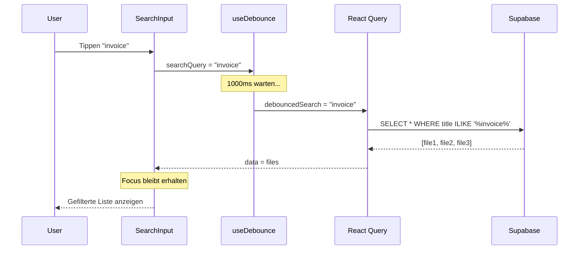

# 18 – Live Search Pattern

**Version:** 1.0  
**Stand:** 2025-01-16  
**Quelle:** Smarte Dokumentenablage

---

## Übersicht

Dieses Pattern implementiert eine Live-Suche mit folgenden Eigenschaften:

- **Debounced Input:** Suchanfragen werden erst nach Pause im Tippen ausgelöst (1000ms)
- **Fokus-Persistenz:** Cursor bleibt im Suchfeld während Ladevorgang
- **React Query Integration:** Automatisches Caching und Invalidierung
- **Server + Client Filter:** Schnelle Server-Suche kombiniert mit feingranularen Client-Filtern
- **i18n Support:** Vollständig übersetzbare Texte

---

## Architektur

```
┌──────────────────┐      ┌──────────────────┐      ┌──────────────────┐
│   User Input     │      │   useDebounce    │      │   React Query    │
│   (searchQuery)  │ ───▶ │   (1000ms)       │ ───▶ │   (API Call)     │
└──────────────────┘      └──────────────────┘      └──────────────────┘
         │                                                   │
         │                                                   ▼
         │                                          ┌──────────────────┐
         │                                          │  Server Response │
         │                                          │  (allFiles)      │
         │                                          └──────────────────┘
         │                                                   │
         ▼                                                   ▼
┌──────────────────┐                              ┌──────────────────┐
│   Focus Persist  │                              │  Client Filter   │
│   (useEffect)    │                              │  (useMemo)       │
└──────────────────┘                              └──────────────────┘
```

### Mermaid Sequenzdiagramm



---

## Kern-Komponenten

### 1. useDebounce Hook

Generischer, wiederverwendbarer Hook für verzögerte Wertaktualisierung:

```typescript
// src/hooks/useDebounce.ts
import { useEffect, useState } from 'react';

/**
 * Custom hook to debounce a value
 * @param value The value to debounce
 * @param delay Delay in milliseconds (default: 600ms)
 * @returns The debounced value
 */
export function useDebounce<T>(value: T, delay: number = 600): T {
  const [debouncedValue, setDebouncedValue] = useState<T>(value);

  useEffect(() => {
    // Set up a timeout to update the debounced value
    const handler = setTimeout(() => {
      setDebouncedValue(value);
    }, delay);

    // Clean up the timeout if value changes before delay expires
    return () => {
      clearTimeout(handler);
    };
  }, [value, delay]);

  return debouncedValue;
}
```

**Eigenschaften:**
- TypeScript Generic für beliebige Typen
- Konfigurierbare Verzögerung
- Automatisches Cleanup bei Value-Änderung oder Unmount

---

### 2. Search Input mit Fokus-Persistenz

```typescript
import { useState, useRef, useEffect } from 'react';
import { useDebounce } from '@/hooks/useDebounce';
import { Input } from '@/components/ui/input';
import { Search, Loader2 } from 'lucide-react';

interface SearchBarProps {
  onSearch: (query: string) => void;
  isLoading?: boolean;
  placeholder?: string;
}

export const SearchBar = ({ onSearch, isLoading, placeholder }: SearchBarProps) => {
  const [searchQuery, setSearchQuery] = useState('');
  const searchInputRef = useRef<HTMLInputElement>(null);
  
  // Debounce mit 1000ms Verzögerung
  const debouncedSearch = useDebounce(searchQuery, 1000);
  
  // Callback bei debounced Änderung
  useEffect(() => {
    onSearch(debouncedSearch);
  }, [debouncedSearch, onSearch]);
  
  // Fokus-Persistenz: Cursor bleibt im Feld während Laden
  useEffect(() => {
    if (searchInputRef.current && document.activeElement !== searchInputRef.current) {
      searchInputRef.current.focus({ preventScroll: true });
    }
  }, [isLoading]);

  return (
    <div className="relative flex-1 max-w-md">
      {isLoading ? (
        <Loader2 className="absolute left-3 top-1/2 -translate-y-1/2 h-4 w-4 text-muted-foreground animate-spin" />
      ) : (
        <Search className="absolute left-3 top-1/2 -translate-y-1/2 h-4 w-4 text-muted-foreground" />
      )}
      <Input
        ref={searchInputRef}
        placeholder={placeholder}
        value={searchQuery}
        onChange={(e) => setSearchQuery(e.target.value)}
        className="pl-10"
      />
    </div>
  );
};
```

**Key Features:**
- `useRef` für programmatischen Fokus-Zugriff
- `preventScroll: true` verhindert Scroll-Sprünge
- Loading Spinner ersetzt Search Icon während Laden

---

### 3. React Query Integration

```typescript
import { useQuery } from '@tanstack/react-query';
import { supabase } from '@/integrations/supabase/client';
import { useDebounce } from '@/hooks/useDebounce';

const [searchQuery, setSearchQuery] = useState('');
const debouncedSearch = useDebounce(searchQuery, 1000);

const { data: files, isLoading, isFetching } = useQuery({
  // debouncedSearch als Teil des queryKey
  queryKey: ['files', user?.id, folderId, sortField, sortOrder, debouncedSearch],
  queryFn: async () => {
    let query = supabase
      .from('files')
      .select('*')
      .eq('owner_id', user!.id);

    // Server-seitige Suche
    if (debouncedSearch) {
      query = query.or(`title.ilike.%${debouncedSearch}%,tags.cs.{${debouncedSearch}}`);
    }

    query = query.order(sortField, { ascending: sortOrder === 'asc' });

    const { data, error } = await query;
    if (error) throw error;
    return data;
  },
  enabled: !!user,
});
```

**Wichtige Punkte:**
- `debouncedSearch` im `queryKey` löst neue Anfrage aus
- `isFetching` zeigt auch Background-Refetches an
- `enabled: !!user` verhindert Anfragen ohne Login

---

## Server-seitige Suche (Supabase)

### Multi-Field Suche mit `.or()`

```typescript
// Suche in Titel UND Tags gleichzeitig
query = query.or(`title.ilike.%${debouncedSearch}%,tags.cs.{${debouncedSearch}}`);
```

**Operatoren:**
| Operator | Beschreibung | Beispiel |
|----------|--------------|----------|
| `ilike` | Case-insensitive LIKE | `title.ilike.%invoice%` |
| `cs` | Contains (für Arrays) | `tags.cs.{wichtig}` |
| `eq` | Exakte Gleichheit | `status.eq.active` |

### Erweiterte Suche mit mehreren Feldern

```typescript
// Suche in title, description, tags
if (debouncedSearch) {
  const searchPattern = `%${debouncedSearch}%`;
  query = query.or(
    `title.ilike.${searchPattern},` +
    `meta->>description.ilike.${searchPattern},` +
    `tags.cs.{${debouncedSearch}}`
  );
}
```

---

## Client-seitige Filter

Für feingranulare Filter ohne zusätzliche API-Calls:

```typescript
const [filters, setFilters] = useState<FileFilters>({
  mimeTypes: [],
  dateFrom: '',
  dateTo: '',
  sizeMin: 0,
  sizeMax: Infinity,
  tags: [],
  documentTypes: [],
});

// Client-Filter auf Server-Ergebnisse anwenden
const filteredFiles = useMemo(() => {
  if (!allFiles) return [];

  return allFiles.filter((file) => {
    // MIME-Type Filter
    if (filters.mimeTypes.length > 0) {
      const matchesMime = filters.mimeTypes.some((mimeType) =>
        file.mime.startsWith(mimeType.replace('/', '')) || file.mime === mimeType
      );
      if (!matchesMime) return false;
    }

    // Datums-Filter
    if (filters.dateFrom) {
      const fileDate = new Date(file.created_at);
      if (fileDate < new Date(filters.dateFrom)) return false;
    }
    if (filters.dateTo) {
      const fileDate = new Date(file.created_at);
      const toDate = new Date(filters.dateTo);
      toDate.setHours(23, 59, 59, 999);
      if (fileDate > toDate) return false;
    }

    // Größen-Filter
    if (file.size < filters.sizeMin || file.size > filters.sizeMax) {
      return false;
    }

    // Tags-Filter
    if (filters.tags.length > 0) {
      if (!file.tags?.some(tag => filters.tags.includes(tag))) {
        return false;
      }
    }

    // Document Type Filter
    if (filters.documentTypes.length > 0) {
      if (!filters.documentTypes.includes(file.meta?.document_type)) {
        return false;
      }
    }

    return true;
  });
}, [allFiles, filters]);
```

**Vorteile:**
- Keine zusätzlichen API-Calls
- Sofortige Reaktion auf Filter-Änderungen
- Kombinierbar mit Server-Suche

---

## Fokus-Persistenz

Das Suchfeld behält den Fokus während der Suche:

```typescript
const searchInputRef = useRef<HTMLInputElement>(null);

// Nach jedem Laden: Fokus wiederherstellen
useEffect(() => {
  if (searchInputRef.current && document.activeElement !== searchInputRef.current) {
    searchInputRef.current.focus({ preventScroll: true });
  }
}, [isLoading, isFetching]);
```

**Wichtig:**
- `preventScroll: true` verhindert dass die Seite zum Input scrollt
- Prüfung `document.activeElement !== searchInputRef.current` vermeidet unnötige Fokus-Calls

---

## i18n Integration

### Translation Keys

```json
// de.json
{
  "documents": {
    "searchPlaceholder": "Dokumente durchsuchen...",
    "noResults": "Keine Dokumente gefunden",
    "noResultsDesc": "Versuche einen anderen Suchbegriff",
    "noDocuments": "Noch keine Dokumente",
    "noDocumentsDesc": "Lade dein erstes Dokument hoch"
  }
}

// en.json
{
  "documents": {
    "searchPlaceholder": "Search documents...",
    "noResults": "No documents found",
    "noResultsDesc": "Try a different search term",
    "noDocuments": "No documents yet",
    "noDocumentsDesc": "Upload your first document"
  }
}
```

### Verwendung

```typescript
import { useTranslation } from 'react-i18next';

const { t } = useTranslation();

<Input placeholder={t('documents.searchPlaceholder')} />

// Empty State mit unterschiedlichen Meldungen
{files.length === 0 && (
  <div className="text-center py-12">
    <p className="text-lg font-medium">
      {searchQuery 
        ? t('documents.noResults') 
        : t('documents.noDocuments')
      }
    </p>
    <p className="text-muted-foreground">
      {searchQuery 
        ? t('documents.noResultsDesc') 
        : t('documents.noDocumentsDesc')
      }
    </p>
  </div>
)}
```

---

## Vollständiges Integrations-Beispiel

```typescript
// src/components/documents/DocumentList.tsx
import { useState, useMemo, useEffect, useRef } from 'react';
import { useQuery } from '@tanstack/react-query';
import { useTranslation } from 'react-i18next';
import { supabase } from '@/integrations/supabase/client';
import { useAuth } from '@/contexts/AuthContext';
import { useDebounce } from '@/hooks/useDebounce';
import { Input } from '@/components/ui/input';
import { Search, Loader2 } from 'lucide-react';

interface DocumentListProps {
  folderId: string | null;
}

export const DocumentList = ({ folderId }: DocumentListProps) => {
  const { user } = useAuth();
  const { t } = useTranslation();
  const searchInputRef = useRef<HTMLInputElement>(null);

  // State
  const [searchQuery, setSearchQuery] = useState('');
  const [sortField, setSortField] = useState<'created_at' | 'title' | 'size'>('created_at');
  const [sortOrder, setSortOrder] = useState<'asc' | 'desc'>('desc');

  // Debounce mit 1000ms
  const debouncedSearch = useDebounce(searchQuery, 1000);

  // Query mit debounced Search
  const { data: allFiles, isLoading, isFetching } = useQuery({
    queryKey: ['files', user?.id, folderId, sortField, sortOrder, debouncedSearch],
    queryFn: async () => {
      let query = supabase
        .from('files')
        .select('*')
        .eq('owner_id', user!.id);

      if (folderId) {
        query = query.eq('folder_id', folderId);
      }

      // Server-Suche
      if (debouncedSearch) {
        query = query.or(`title.ilike.%${debouncedSearch}%,tags.cs.{${debouncedSearch}}`);
      }

      query = query.order(sortField, { ascending: sortOrder === 'asc' });

      const { data, error } = await query;
      if (error) throw error;
      return data;
    },
    enabled: !!user,
  });

  // Fokus-Persistenz
  useEffect(() => {
    if (searchInputRef.current && document.activeElement !== searchInputRef.current) {
      searchInputRef.current.focus({ preventScroll: true });
    }
  }, [isLoading, isFetching]);

  return (
    <div className="space-y-4">
      {/* Search Bar */}
      <div className="flex items-center gap-4">
        <div className="relative flex-1 max-w-md">
          {isFetching ? (
            <Loader2 className="absolute left-3 top-1/2 -translate-y-1/2 h-4 w-4 text-muted-foreground animate-spin" />
          ) : (
            <Search className="absolute left-3 top-1/2 -translate-y-1/2 h-4 w-4 text-muted-foreground" />
          )}
          <Input
            ref={searchInputRef}
            placeholder={t('documents.searchPlaceholder')}
            value={searchQuery}
            onChange={(e) => setSearchQuery(e.target.value)}
            className="pl-10"
          />
        </div>
      </div>

      {/* Results */}
      {isLoading ? (
        <div className="flex justify-center py-12">
          <Loader2 className="h-8 w-8 animate-spin text-muted-foreground" />
        </div>
      ) : allFiles?.length === 0 ? (
        <div className="text-center py-12">
          <p className="text-lg font-medium text-foreground">
            {searchQuery ? t('documents.noResults') : t('documents.noDocuments')}
          </p>
          <p className="text-muted-foreground">
            {searchQuery ? t('documents.noResultsDesc') : t('documents.noDocumentsDesc')}
          </p>
        </div>
      ) : (
        <div className="grid gap-4">
          {allFiles?.map((file) => (
            <div key={file.id} className="p-4 border rounded-lg">
              <h3 className="font-medium">{file.title}</h3>
            </div>
          ))}
        </div>
      )}
    </div>
  );
};
```

---

## UX Best Practices

### 1. Loading States

```typescript
// Unterscheide zwischen Initial-Load und Refetch
{isLoading ? (
  // Skeleton für Initial-Load
  <Skeleton className="h-12 w-full" />
) : isFetching ? (
  // Spinner im Input für Refetch
  <Loader2 className="animate-spin" />
) : (
  // Normal Icon
  <Search />
)}
```

### 2. Empty States

```typescript
// Differenzierte Meldungen
const emptyState = useMemo(() => {
  if (searchQuery && files.length === 0) {
    return {
      title: t('documents.noResults'),
      description: t('documents.noResultsDesc'),
      action: <Button onClick={() => setSearchQuery('')}>{t('common.clearSearch')}</Button>
    };
  }
  if (filters.hasActiveFilters && files.length === 0) {
    return {
      title: t('documents.noFilterResults'),
      description: t('documents.noFilterResultsDesc'),
      action: <Button onClick={clearFilters}>{t('common.clearFilters')}</Button>
    };
  }
  return {
    title: t('documents.noDocuments'),
    description: t('documents.noDocumentsDesc'),
    action: <UploadButton />
  };
}, [searchQuery, files, filters, t]);
```

### 3. Keyboard Shortcuts (Optional)

```typescript
// Fokus mit "/" oder Ctrl+K
useEffect(() => {
  const handleKeyDown = (e: KeyboardEvent) => {
    if (e.key === '/' && document.activeElement?.tagName !== 'INPUT') {
      e.preventDefault();
      searchInputRef.current?.focus();
    }
    if ((e.metaKey || e.ctrlKey) && e.key === 'k') {
      e.preventDefault();
      searchInputRef.current?.focus();
    }
  };

  document.addEventListener('keydown', handleKeyDown);
  return () => document.removeEventListener('keydown', handleKeyDown);
}, []);
```

---

## Varianten & Erweiterungen

### Command Palette (cmdk)

Für Power-User mit `cmdk`:

```typescript
import { Command, CommandInput, CommandList, CommandItem } from 'cmdk';

<Command>
  <CommandInput placeholder="Suchen..." />
  <CommandList>
    {files.map(file => (
      <CommandItem key={file.id} onSelect={() => openFile(file)}>
        {file.title}
      </CommandItem>
    ))}
  </CommandList>
</Command>
```

### Autocomplete / Suggestions

```typescript
const suggestions = useMemo(() => {
  if (searchQuery.length < 2) return [];
  
  return allFiles
    ?.filter(f => f.title.toLowerCase().includes(searchQuery.toLowerCase()))
    .slice(0, 5)
    .map(f => f.title);
}, [searchQuery, allFiles]);
```

### Recent Searches (localStorage)

```typescript
const [recentSearches, setRecentSearches] = useState<string[]>(() => {
  const stored = localStorage.getItem('recentSearches');
  return stored ? JSON.parse(stored) : [];
});

const addRecentSearch = (query: string) => {
  const updated = [query, ...recentSearches.filter(s => s !== query)].slice(0, 5);
  setRecentSearches(updated);
  localStorage.setItem('recentSearches', JSON.stringify(updated));
};
```

---

## Performance-Optimierungen

### 1. Debounce-Zeit anpassen

```typescript
// Schneller für kurze Listen (< 100 Items)
const debouncedSearch = useDebounce(searchQuery, 300);

// Langsamer für große Datenmengen
const debouncedSearch = useDebounce(searchQuery, 1000);
```

### 2. Minimale Suchbegriff-Länge

```typescript
// Suche erst ab 2 Zeichen
if (debouncedSearch && debouncedSearch.length >= 2) {
  query = query.or(`title.ilike.%${debouncedSearch}%`);
}
```

### 3. Query Stale Time

```typescript
const { data } = useQuery({
  queryKey: ['files', debouncedSearch],
  queryFn: fetchFiles,
  staleTime: 30000, // 30 Sekunden Cache
});
```

---

## Querverweis

- **[01-Auth-Profile-Pattern](./01-Auth-Profile-Pattern.md):** User Context für `owner_id` Filter
- **[06-UI-UX-Pattern](./06-UI-UX-Pattern.md):** Input-Styling, Loading States
- **[15-i18n-Pattern](./15-i18n-Pattern.md):** Mehrsprachige Platzhalter

---

## Changelog

| Version | Datum | Änderungen |
|---------|-------|------------|
| 1.0 | 2025-01-16 | Initial Release |
